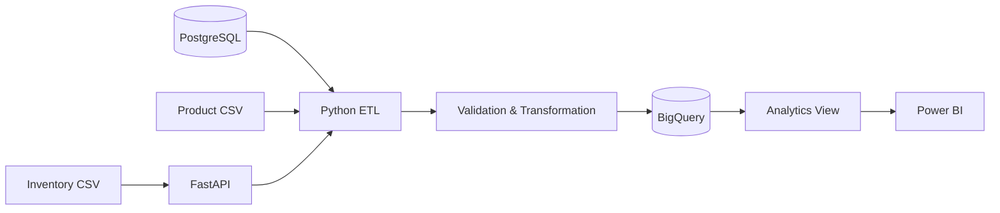
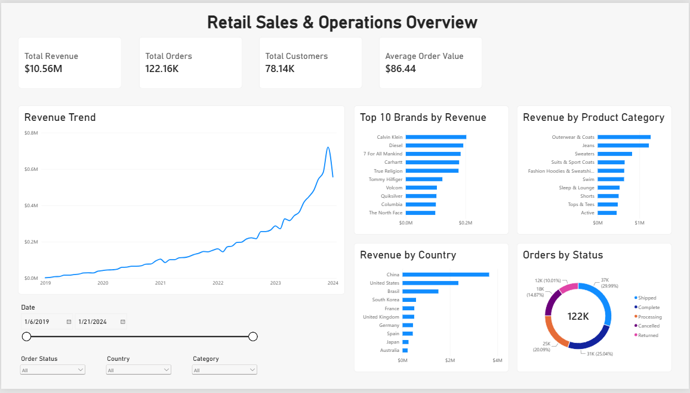
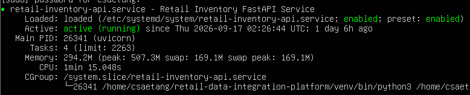
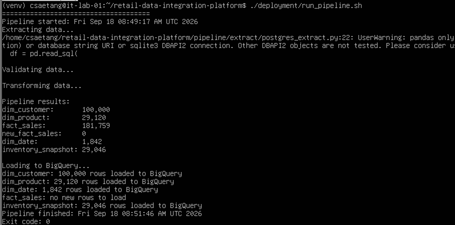
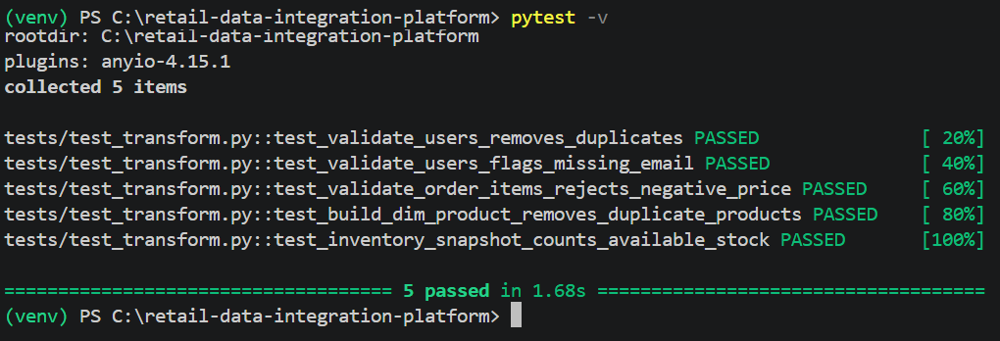

# Retail Data Integration & Analytics Platform

## Overview

This project is an end-to-end retail data pipeline I built to practice integrating data from multiple sources into a cloud data warehouse.

Using the synthetic TheLook eCommerce dataset, the project combines customer and order data from PostgreSQL, product data from CSV files, and inventory data from a REST API. A Python ETL pipeline validates and transforms the data before loading it into Google BigQuery, where it is used for analysis in Power BI.

The pipeline was also deployed to an Ubuntu virtual machine to practice Linux deployment, service management, and automated scheduling.

---

## Business Problem

Retail data is often stored across different systems, which makes it difficult to analyze without first bringing the data together.

For this project, I simulated this by separating the dataset across three sources:

- PostgreSQL for customers, orders, and order items
- CSV files for product data
- FastAPI REST API for inventory data

The goal was to build one pipeline that could collect these sources, validate the data, transform it into an analytics-friendly structure, and load it into a central warehouse.

---

## Architecture



### Pipeline Flow

```text
PostgreSQL ─────┐
Products CSV ───┼──> Python ETL
Inventory API ──┘        │
                         ▼
                Validate & Transform
                         │
                         ▼
                     BigQuery
                         │
                         ▼
                   Analytics View
                         │
                         ▼
                      Power BI
```

---

## What the Project Includes

### Data Integration

The pipeline extracts data from three different types of sources:

- PostgreSQL relational database
- CSV files
- REST API built with FastAPI

The source data includes approximately:

- 100,000 customers
- 125,000 orders
- 181,000 order items
- 490,000 inventory records

### Data Validation

Before loading data into the warehouse, the pipeline performs validation including:

- Duplicate removal
- Missing email detection
- Timestamp validation
- Product ID validation
- Negative sale price rejection

### Data Transformation

The source data is transformed into a simple dimensional model:

```text
dim_customer
dim_product
dim_date
fact_sales
inventory_snapshot
```

This separates descriptive customer and product information from sales transactions and makes the data easier to analyze.

### BigQuery Warehouse

The transformed data is loaded into a Google BigQuery dataset called:

```text
retail_warehouse
```

Dimension and inventory tables are refreshed when the pipeline runs.

The `fact_sales` table uses incremental loading. The pipeline checks the latest `sale_id` already stored in BigQuery and only loads newer records.

This allows the pipeline to be rerun without duplicating existing sales.

### Power BI Dashboard

A BigQuery view called:

```text
vw_sales_enriched
```

combines sales, customer, and product information for reporting.

The Power BI dashboard includes:

- Total Revenue
- Total Orders
- Total Customers
- Average Order Value
- Revenue Trend
- Top 10 Brands by Revenue
- Revenue by Product Category
- Revenue by Country
- Orders by Status

Users can also filter the dashboard by date, order status, country, and product category.

---

## Linux Deployment

I deployed the project to an Ubuntu virtual machine to practice running a data pipeline in a Linux environment.

The FastAPI inventory service is managed using:

```text
systemd
```

The ETL pipeline is scheduled using:

```text
cron
```

and runs automatically every day at **2:00 AM**.

Pipeline output is written to log files so that scheduled runs can be reviewed afterward.

The VM is used as a simulated deployment environment for learning and testing rather than as a production server.

---

## Testing

I added automated tests using `pytest` for important validation and transformation rules.

The tests currently cover:

- Duplicate customer removal
- Missing customer email detection
- Negative sale price rejection
- Duplicate product removal
- Inventory stock calculation

Current result:

```text
5 passed
```

---

## Dashboard

<!--

-->

---

## Deployment & Testing

The project was deployed to an Ubuntu virtual machine, where the inventory API runs as a systemd service and the ETL pipeline can be executed and scheduled in a Linux environment.

### Inventory API Service



### ETL Pipeline



### Scheduled Pipeline

The ETL pipeline is scheduled with cron to run automatically every day at 2:00 AM.


### Automated Tests



---

## Technologies

| Technology | Use |
|---|---|
| Python | ETL pipeline |
| Pandas | Data validation and transformation |
| PostgreSQL | Operational data source |
| FastAPI | Inventory REST API |
| Google BigQuery | Cloud data warehouse |
| SQL | Data modeling and analytics |
| Power BI | Dashboard and reporting |
| Ubuntu Linux | Deployment environment |
| systemd | API service management |
| cron | Pipeline scheduling |
| pytest | Automated testing |
| Git & GitHub | Version control |

---

## Project Structure

```text
retail-data-integration-platform/
│
├── api/
│   └── inventory_api.py
│
├── database/
│   └── load_source_data.py
│
├── pipeline/
│   ├── extract/
│   ├── transform/
│   ├── load/
│   └── main.py
│
├── tests/
│   └── test_transform.py
│
├── docs/
│   └── images/
│
├── requirements.txt
└── README.md
```

Raw datasets, environment variables, credentials, and logs are excluded from the repository.

---

## Running the Project

Install the required Python packages:

```bash
pip install -r requirements.txt
```

Create a `.env` file containing the required PostgreSQL and BigQuery configuration.

Start the inventory API:

```bash
uvicorn api.inventory_api:app --reload
```

Run the ETL pipeline:

```bash
python -m pipeline.main
```

Run the automated tests:

```bash
pytest -v
```

---

## What I Learned

This project helped me understand how the individual parts of a data engineering system connect together.

Instead of working with one dataset inside a notebook, I had to work with different data sources, build extraction logic, validate and transform the data, design warehouse tables, implement incremental loading, and connect the final warehouse to a BI tool.

Deploying the project to Linux also gave me experience working with systemd, cron, logging, environment configuration, and troubleshooting applications outside of my local development environment.

Some of the main challenges I worked through included PostgreSQL datatype issues, API connectivity, Google Cloud authentication, incremental loading, and configuring the pipeline to run automatically.

---

## Future Improvements

Some areas I could expand in the future include:

- More automated test coverage
- Pipeline failure notifications
- More detailed data quality checks
- Pipeline run metadata and monitoring
- CI testing with GitHub Actions

For this version, I kept the project focused on the core concepts I wanted to practice: **multi-source integration, ETL development, data warehousing, analytics, and Linux deployment.**